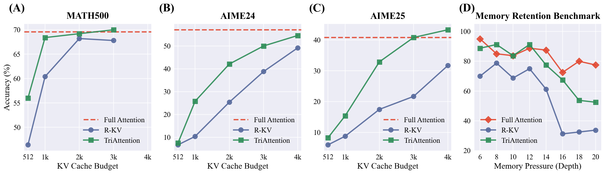
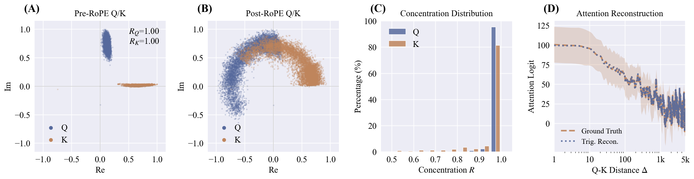

# Full Results

## AIME24 / AIME25 (KV Budget = 2048, DS-Llama = 512)

| Method | Qwen3-8B | DS-Llama-8B | DS-Qwen-7B | GPT-OSS-20B |
|--------|----------|-------------|-------------|-------------|
| Full Attention | 57.1 / 40.8 | 50.4 / 31.4 | 43.8 / 34.2 | 69.2 / 60.0 |
| SnapKV | 34.6 / 20.0 | 5.0 / 6.7 | 34.6 / 25.0 | 48.3 / 36.7 |
| R-KV | 25.4 / 17.5 | 25.8 / 11.2 | 34.6 / 23.3 | 49.6 / 39.2 |
| **TriAttention** | **42.1 / 32.9** | **33.8 / 19.6** | **42.5 / 30.0** | **59.2 / 49.2** |

## MATH-500 (KV Budget = 512)

| Method | Qwen3-8B | DS-Llama-8B | DS-Qwen-7B | GPT-OSS-20B |
|--------|----------|-------------|-------------|-------------|
| Full Attention | 69.6 | 82.4 | 87.0 | 91.4 |
| SnapKV | 49.2 | 65.5 | 66.4 | 68.2 |
| R-KV | 46.4 | 76.9 | 71.6 | 77.4 |
| **TriAttention** | **56.0** | **80.6** | **79.6** | **81.2** |

## Throughput (Qwen3-8B, tokens/sec)

| Benchmark | TriAttn Budget | Full Acc | TriAttn Acc | Full Throughput | TriAttn Throughput | Speedup |
|-----------|---------------|----------|-------------|-----------------|-------------------|---------|
| MATH-500 | 1024 | 69.6 | 68.4 | 222.8 | 1405.2 | **6.3x** |
| AIME24 | 4096 | 57.1 | 54.6 | 222.8 | 413.9 | **1.9x** |
| AIME25 | 3072 | 40.8 | 40.8 | 222.8 | 563.5 | **2.5x** |

## Accuracy vs. KV Budget

  

Accuracy vs. KV budget across MATH-500, AIME24, AIME25, and DFS Memory Retention benchmarks. TriAttention consistently outperforms R-KV and SnapKV across all budget levels. On the Recursive State Query benchmark, TriAttention performs comparably to Full Attention up to depth 16, while R-KV shows catastrophic degradation.

## Motivation: Q/K Concentration

  

Pre-RoPE Q/K vectors concentrate around fixed centers, enabling trigonometric modeling of attention patterns. This structure is stable across positions and input contexts.
